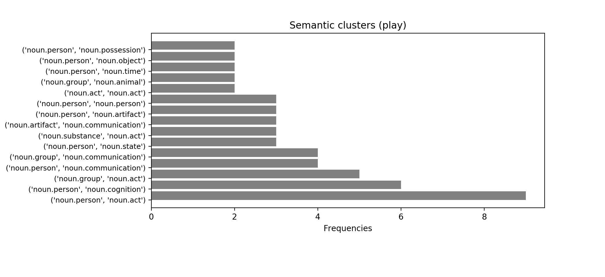
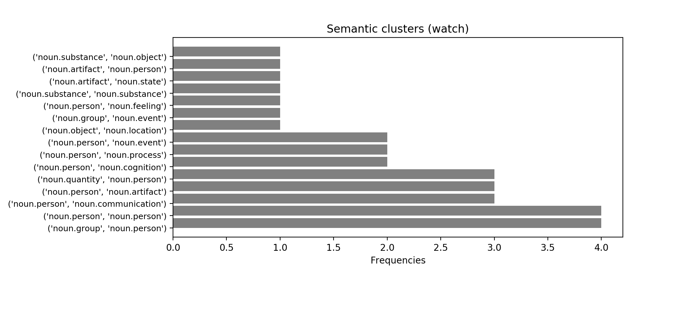
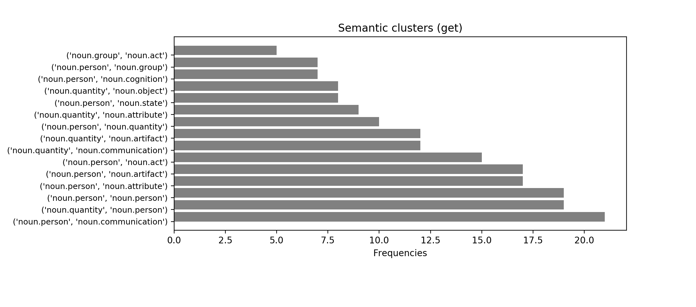

# **Content to form**

  

>L’esercitazione prevede l’implementazione della teoria di P. Hanks:

>1.	Scegliere un verbo transitivo (minimo valenza = 2);
>2.	Recuperare da un corpus n istanze in cui esso viene usato;
>3.	Effettuare parsing e disambiguazione
>4.	Usare i super sensi di WordNet sugli argomenti (subj e obj) del verbo scelto;
>5.	Aggregare i risultati, calcolare le frequenze, stampare i cluster semantici ottenuti.
>   *	Un **cluster semantico** è inteso come combinazione dei semantic types (ad esempio coppie di sem_types se valenza = 2)

 

# 0. Scelta del verbo 

I test sono stati fatti con i verbi *watch*, *play* e *get*.

  

# 1. Ottenere le istanze contenenti il verbo scelto

Le istanze vengono recuperate dal Brown Corpus. La funzione `extractBrownSentences()` permette di estrarre tutte le frasi dal corpus (attraverso la funzione `brown.sents()`).

Successivamente si cicla su ogni termine di ogni frase estratta e si determina il part-of-speech della frase (`nltk.pos_tag(sent)`). Nel caso in cui il TAG del termine sia un verbo, allora viene lemmatizzato. Nel caso in cui il termine sia uguale al verbo scelto la frase viene selezionata e aggiunta alla lista di frasi da analizzare.

~~~~python
def extractBrownSentences(verb, verbs_pos):
    lemmatizer = WordNetLemmatizer()

    list_sent = brown.sents() #  Return all sentences in the corpus or in the specified file(s).
    sentences = []
    for sent in list_sent:
        tags = dict(nltk.pos_tag(sent))
        for word in sent:
            if tags[word] in verbs_pos:
                word = lemmatizer.lemmatize(word, 'v')
                if word == verb:
                    sentences.append(sent)
    return sentences
~~~~

Siccome questa operazione richiede parecchio tempo per essere eseguita, il risultato (le frasi estratte) vengono salvate nel file *sentences.txt* e lette ad ogni esecuzione.

  

# 2. Parsing e disambiguazione

La teoria di Hanks si basa sull'idea che il verbo sia la radice del significato, in quanto non esistono espressioni senza verbo. Ad ogni verbo viene associata una valenza, ovvero il numero di argomenti necessari per il verbo. In base al numero di argomenti che un verbo richiede, in certi casi è possibile differenziarne il
significato.

 

Dopo aver ottenuto le frasi contenenti il verbo scelto, è necessario fare il parsing e la disambiguazione.

Per ogni frase si determina l'albero a dipendenze grazie alla funzione `dependencyParsing()`. Successivamente si utilizza `spaCy`[1] per determinare il soggetto e l'oggetto associato al verbo scelto (gli argomenti del verbo).

Dato l'albero a dipendenze della frase (`tree`), i tre elementi si determinano come segue:

* `verbAddress` è il termine nell'albero il quale corrisponde ai verbi scelti;
* `subjects` è una lista contenente tutti i termini della frase il cui reggente (`head`) è `verbAddress`, la cui relazione sintattica (`dep_`) è `nsubj` e il cui part-of-speech (`tag_`) è `NN`;
* `objects` è una lista contenente tutti i termini della frase il cui reggente (`head`) è `verbAddress`, la cui relazione sintattica (`dep_`) è `obj` e il cui part-of-speech (`tag_`) è `NN`;

~~~~python
def extractVerbSubjObj (verb, tree):
    verbAddress = next(t.text for t in tree if t.text in verb)
    subjects = list(t.text for t in tree if str(t.head) == verbAddress and "nsubj" in t.dep_ and "NN" in t.tag_)
    objects = list(t.text for t in tree if str(t.head) == verbAddress and "obj" in t.dep_ and "NN" in t.tag_)
    return subjects, objects
~~~~

In questo modo è possibile determinare i filler (soggetti nominali e oggetti) del verbo scelto [2].

Nel caso in cui il verbo abbia valenza 2 e quindi entrambi i filler sono presenti, si calcola attraverso l'algoritmo di Lesk il miglior WordNet synset associato ad ogni filler. L'algoritmo di Lesk prende in input un termine polisemico e la frase in cui occorre e restituisce il senso migliore.

Per ogni senso associato al termine da disambiguare (ottenuto tramite `wn.synsets(word)`), la funzione `lesk()` calcola l'overlap tra i contesti della frase e del synset. I due contesti sono ottenuti con un approccio bag-of-words e sono composti da:

* `ctx_sentence`: composto da tutti i termini della frase soggetti a pre-processing (tokenizzazione, rimozione punteggiatura e stopwords, lemmatizzazione). 
* `ctx_synset`: composto da tutti i termini presenti nella definizione e negli esempi soggetti a pre-processing (tokenizzazione, rimozione punteggiatura e stopwords, lemmatizzazione). 

L'algoritmo ritorna il senso migliore, ovvero il synset che ha ottenuto l'overlap maggiore.

 

Successivamente, nel caso in cui l'algoritmo di Lesk abbia ritornato un senso, si determinano i tipi semantici, ovvero delle generalizzazioni concettuali strutturate come una gerarchia. Questo procedimento viene fatto in quanto il significato di un verbo dipende dagli argomenti e dai tipi semantici ad esso associati.
Il tipo semantico di un synset si ottiene determinando il suo super senso (attraverso la funzione `synset.lexname()` [3]). 
Nel caso in cui il soggetto o l’oggetto siano dei pronomi personali, viene associato il supersenso `noun.person` o `noun.object` (se il pronome è *it*).

Infine gli argomenti del verbo con valenza 2 vengono aggiunti ad una lista (`instances`) in modo da semplificare il calcolo delle frequenze. `instances` è una lista contenente tutte le istanze (frasi) in cui il verbo ha valenza 2 (dove è presente sia il soggetto che l'oggetto del verbo).

  

# 3. Calcolo delle frequenze

L'ultimo step prevede l'aggregazione dei risultati attraverso il calcolo delle frequenze. Queste vengono calcolate con la funzione `getFrequency()`, la quale cicla su tutti gli elementi della lista istance `instances` e calcola la frequenza dei valori dei supersensi relativi ai filler desiderati ()

~~~~python
count = collections.Counter([s for i in instances for s in i.arg]).most_common()
~~~~

Successivamente viene calcolata in maniera analoga la frequenza dei cluster semantici, ovvero la combinazione dei semantic types.

  

# 4. Risultati

Nella seguente tabella sono presenti i risultati ottenuti:

~~~~plain
VERB: play
TOTAL SENTENCES: 308
SENTENCES ANALYZED (valency = 2): 117

____ SEMANTIC CLUSTER (43)

[(('noun.person', 'noun.act'), 9), (('noun.person', 'noun.cognition'), 6), (('noun.group', 'noun.act'), 5), (('noun.person', 'noun.communication'), 4), (('noun.group', 'noun.communication'), 4), (('noun.person', 'noun.state'), 3), (('noun.substance', 'noun.act'), 3), (('noun.artifact', 'noun.communication'), 3), (('noun.person', 'noun.artifact'), 3), (('noun.person', 'noun.person'), 3), (('noun.act', 'noun.act'), 2), (('noun.group', 'noun.animal'), 2), (('noun.person', 'noun.time'), 2), (('noun.person', 'noun.object'), 2), (('noun.person', 'noun.possession'), 2), (('noun.substance', 'noun.artifact'), 2), (('noun.group', 'noun.person'), 2), (('noun.communication', 'noun.act'), 2), (('noun.object', 'noun.act'), 2), (('noun.relation', 'noun.act'), 2), (('noun.communication', 'noun.state'), 2), (('noun.quantity', 'noun.person'), 2), (('noun.attribute', 'noun.communication'), 1), (('noun.artifact', 'noun.time'), 1), (('noun.quantity', 'noun.artifact'), 1), (('noun.object', 'noun.cognition'), 1), (('noun.group', 'noun.process'), 1), (('noun.attribute', 'noun.person'), 1), (('noun.relation', 'noun.communication'), 1), (('noun.quantity', 'noun.possession'), 1), (('noun.quantity', 'noun.act'), 1), (('noun.communication', 'noun.communication'), 1), (('noun.artifact', 'noun.artifact'), 1), (('noun.cognition', 'noun.communication'), 1), (('noun.artifact', 'noun.act'), 1), (('noun.attribute', 'noun.act'), 1), (('noun.act', 'noun.communication'), 1), (('noun.substance', 'noun.communication'), 1), (('noun.event', 'noun.communication'), 1), (('noun.location', 'noun.cognition'), 1), (('noun.artifact', 'noun.substance'), 1), (('noun.person', 'noun.location'), 1), (('noun.person', 'noun.food'), 1)]
~~~~

~~~~plain
VERB: watch
TOTAL SENTENCES: 197
SENTENCES ANALYZED (valency = 2): 53

____ SEMANTIC CLUSTER (27)

[(('noun.group', 'noun.person'), 4), (('noun.person', 'noun.person'), 4), (('noun.person', 'noun.communication'), 3), (('noun.person', 'noun.artifact'), 3), (('noun.quantity', 'noun.person'), 3), (('noun.person', 'noun.cognition'), 2), (('noun.person', 'noun.process'), 2), (('noun.person', 'noun.event'), 2), (('noun.object', 'noun.location'), 1), (('noun.group', 'noun.event'), 1), (('noun.person', 'noun.feeling'), 1), (('noun.substance', 'noun.substance'), 1), (('noun.artifact', 'noun.state'), 1), (('noun.artifact', 'noun.person'), 1), (('noun.substance', 'noun.object'), 1), (('noun.quantity', 'noun.event'), 1), (('noun.person', 'noun.object'), 1), (('noun.act', 'noun.person'), 1), (('noun.substance', 'noun.artifact'), 1), (('noun.substance', 'noun.cognition'), 1), (('noun.substance', 'noun.person'), 1), (('noun.person', 'noun.possession'), 1), (('noun.animal', 'noun.event'), 1), (('noun.quantity', 'noun.act'), 1), (('noun.act', 'noun.artifact'), 1), (('noun.location', 'noun.person'), 1), (('noun.quantity', 'noun.object'), 1)]
~~~~

~~~~plain
VERB: get
TOTAL SENTENCES: 1407
SENTENCES ANALYZED (valency = 2): 422

____ SEMANTIC CLUSTER (85)

[(('noun.person', 'noun.communication'), 21), (('noun.quantity', 'noun.person'), 19), (('noun.person', 'noun.person'), 19), (('noun.person', 'noun.attribute'), 17), (('noun.person', 'noun.artifact'), 17), (('noun.person', 'noun.act'), 15), (('noun.quantity', 'noun.communication'), 12), (('noun.quantity', 'noun.artifact'), 12), (('noun.person', 'noun.quantity'), 10), (('noun.quantity', 'noun.attribute'), 9), (('noun.person', 'noun.state'), 8), (('noun.quantity', 'noun.object'), 8), (('noun.person', 'noun.cognition'), 7), (('noun.person', 'noun.group'), 7), (('noun.group', 'noun.act'), 5), (('noun.person', 'noun.object'), 5), (('noun.person', 'noun.possession'), 5), (('noun.substance', 'noun.attribute'), 4), (('noun.person', 'noun.food'), 4), (('noun.quantity', 'noun.cognition'), 4), (('noun.quantity', 'noun.state'), 4), (('noun.person', 'noun.event'), 3), (('noun.quantity', 'noun.possession'), 3), (('noun.person', 'noun.feeling'), 3), (('noun.person', 'noun.time'), 3), (('noun.group', 'noun.person'), 3), (('noun.Tops', 'noun.quantity'), 3), (('noun.body', 'noun.communication'), 2), (('noun.artifact', 'noun.act'), 2), (('noun.animal', 'noun.act'), 2), (('noun.artifact', 'noun.person'), 2), (('noun.person', 'noun.location'), 2), (('noun.person', 'noun.substance'), 2), (('noun.group', 'noun.time'), 2), (('noun.substance', 'noun.object'), 2), (('noun.cognition', 'noun.communication'), 2), (('noun.substance', 'noun.state'), 2), (('noun.person', 'noun.Tops'), 2), (('noun.substance', 'noun.quantity'), 2), (('noun.substance', 'noun.group'), 2), (('noun.quantity', 'noun.location'), 2), (('noun.substance', 'noun.possession'), 2), (('noun.state', 'noun.person'), 2), (('noun.group', 'noun.state'), 2), (('noun.quantity', 'noun.food'), 2), (('noun.substance', 'noun.cognition'), 2), (('noun.substance', 'noun.animal'), 2), (('noun.substance', 'noun.event'), 2), (('noun.substance', 'noun.artifact'), 2), (('noun.act', 'noun.person'), 2), (('noun.substance', 'noun.communication'), 2), (('noun.quantity', 'noun.group'), 2), (('noun.object', 'noun.feeling'), 1), (('noun.group', 'noun.cognition'), 1), (('noun.group', 'noun.possession'), 1), (('noun.attribute', 'noun.person'), 1), (('noun.act', 'noun.quantity'), 1), (('noun.group', 'noun.communication'), 1), (('noun.location', 'noun.attribute'), 1), (('noun.cognition', 'noun.cognition'), 1), (('noun.phenomenon', 'noun.communication'), 1), (('noun.person', 'noun.plant'), 1), (('noun.object', 'noun.animal'), 1), (('noun.person', 'noun.body'), 1), (('noun.animal', 'noun.object'), 1), (('noun.group', 'noun.food'), 1), (('noun.state', 'noun.possession'), 1), (('noun.act', 'noun.cognition'), 1), (('noun.communication', 'noun.object'), 1), (('noun.artifact', 'noun.attribute'), 1), (('noun.substance', 'noun.location'), 1), (('noun.location', 'noun.person'), 1), (('noun.location', 'noun.artifact'), 1), (('noun.animal', 'noun.communication'), 1), (('noun.substance', 'noun.time'), 1), (('noun.substance', 'noun.person'), 1), (('noun.group', 'noun.artifact'), 1), (('noun.quantity', 'noun.substance'), 1), (('noun.person', 'noun.phenomenon'), 1), (('noun.cognition', 'noun.object'), 1), (('noun.quantity', 'noun.quantity'), 1), (('noun.substance', 'noun.act'), 1), (('noun.object', 'noun.person'), 1), (('noun.communication', 'noun.state'), 1), (('noun.quantity', 'noun.act'), 1)]
~~~~

 

Di seguito l’istogramma relativo ai 15 semantic clusters più frequenti.

  

# 5. Sitografia

[1] <https://spacy.io/usage/linguistic-features>  
[2] <https://spacy.io/api/annotation>  
[3] <https://wordnet.princeton.edu/documentation/lexnames5wn>
