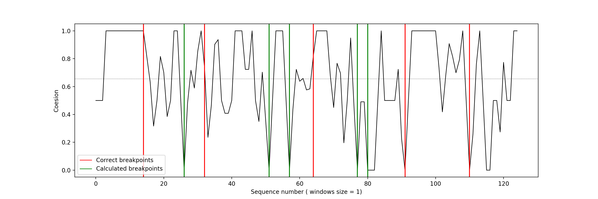
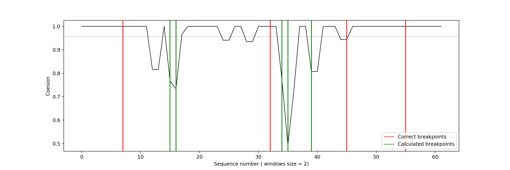
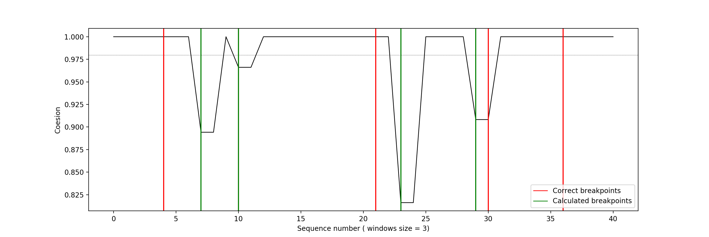
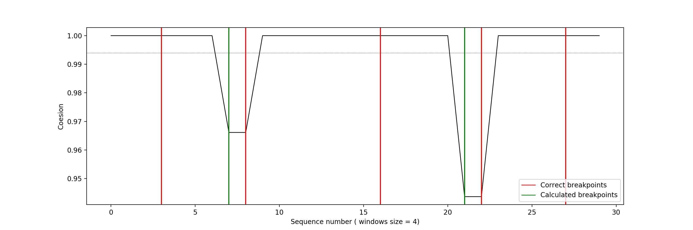

# **Text segmentation**

  

>L’esercitazione prevede l’implementazione, ispirandosi al Text Tiling, di un algoritmo di segmentazione del testo:
>
>1.	Usando informazioni come frequenze (globali, locali), co-occorrenze, risorse semantiche (WordNet, etc.), applicando step di preprocessing (as usual), etc.
>
>  * La scelta del testo è a discrezione dello studente.

 

# 0. Lettura del documento, windowing e lettura Nasari

Il metodo del text tiling prevede che il testo venga separato in finestre di lunghezza fissa. Quindi il documento da analizzare (*document.txt*) viene letto come una stringa grazie alla funzione `loadDocument()` e successivamente diviso in finestre con la funzione `textWindowing()`. 

~~~~python
def loadDocument(path):
    with open(path) as file:
        lines = file.readlines()
    return ''.join(lines)
~~~~

Questa funzione prende in input il documento da dividere e la dimensione delle finestre (inteso come numero di frasi). Il documento viene diviso in frasi (`re.split("\.\s+", document)`) e ogni frase viene tokenizzata (`[nltk.word_tokenize(sentence.lower()) for sentence in tokens]`). In base alla dimensione della finestra, vengono create delle liste contenenti il numero scelto di frasi tokenizzate. Nel caso in cui non tutte le frasi siano state finestrate, le restanti vengono unite in un'unica finestra.

~~~~python
def textWindowing(document, length):
    sequences = []
    tokens = re.split("\.\s+", document)
    tokens = [nltk.word_tokenize(sentence.lower()) for sentence in tokens]
    j = 0
    for i in range(length, len(tokens) + 1, length):
        window = sum(tokens[j:i],[])
        sequences.append(window)
        j = i
    
    if len(tokens) != j:
        diff = len(tokens) - j
        sequences.append(sum(tokens[-diff:],[]))
    return sequences
~~~~

 

Per valutare l'agreement tra finestre si utilizza la risorsa Nasari (*dd-nasari.txt*). Per questo motivo è necessario caricare i vettori Nasari grazie alla funzione `loadNasari()` la quale, a partire da un file *.txt*, crea un dizionario con la forma `{word: {term:score}}`

  

# 1. Calcolo della coesione tra finestre

L'idea di questo procedimento è quella di calcolare la coesione di una finestra rispetto a quelle adiacenti, sulla base dei termini rilevanti (soggetti a pre-processing) presenti in ogni finestra. Invece di calcolare la coesione direttamente sui termini, per ogni termine si determina il vettore Nasari associato, in modo da determinare il concetto espresso dal termine.

La funzione `getNasariVectors()` prende in ingresso la lista di termini (finestra) e il dizionario Nasari, la pre-processa (rimozione stopword e punteggiatura, lemmatizzazione) e, per ogni termine della lista pre-processata ritorna, se presente, il vettore Nasari associato.

~~~~python
def getNasariVectors(sentence, nasari):
    topic = bagOfWord(sentence)
    vectors = []
    for word in topic:
        if word in nasari.keys():
            vectors.append(nasari[word])
    return vectors
~~~~

Per ogni finestra vengono calcolati i vettori Nasari della finestra corrente (`current`), della finestra precedente (`prev`) e quella successiva (`follo`). Successivamente si calcola la coesione tra le finestre  `current`-`prev` e `current`-`follo` grazie alla funzione `getSimilarity()`.

Questa funzione calcola, per ogni vettore di entrambe le liste la Weighted Overlap tra i due vettori. La Weighted Overlap è una funzione che permette di calcolare la similarità semantica tra concetti e si calcola come:

~~~~python
n = sum(1 / (rank(q, list(vect1)) + rank(q, list(vect2))) for q in keys_overlap)
d = sum(list(map(lambda x: 1 / (2 * x), list(range(1, len(keys_overlap) + 1)))))

wo = n/d
~~~~

dove:

* `keys_overlap`: insieme delle chiavi comuni ai due vettori;
* `rank`: calcola il rango del termine per un vettore, ovvero la sua rilevanza;
* `n`: sommatoria del reciproco della somma tra i rank dei vettori Nasari e q, dove q è una chiave comune;
* `d`: Sommatoria di i che va da 1 alla cardinalità dell'insieme delle chiavi in comune del reciproco del doppio di i.

La funzione getWeightedOverlap() ritorna il rapporto se l'insieme delle chiavi in comuni non è vuoto, 0 altrimenti.

La coesione tra due finestre è data dal massimo valore della radice quadrata della Weighted Overlap.

 

Dopo aver determinato la coesine di una finestra rispetto a quelle adiacenti, la coesione della finestra è data dalla media dei due valori di coesine appena calcolati.

  

# 2. Calcolo split points

Per determinare i punti in cui dividere il testo, in modo da determinare i paragrafi, si scorre la lista contenente i valori di coesione (`similarities`). Una finestra corrisponde ad un punto di divisione (split point) se il suo valore di coesione è minore rispetto la media dei valori totali e se il valore precedente non è già nella lista degli split points. Quest'ultima condizione viene ignorata solo nel caso in cui il valore di coesione corrente risulti essere più basso rispetto a quello precedente. Le valutazioni sugli elementi consecutivi dipendono dal fatto che finestre successive possono avere un valore correlato. Nel caso in cui due finestre successive abbiano valori simili ed entrambi minori rispetto alla media, questi verrebbero considerati come due punti di split.

I possibili punti di split (`splits`) vengono poi ordinati in base al valore di similarità della finestra. Sapendo il numero di paragrafi in cui dividere il testo, vengono estratti dalla lista gli split points con valore più basso di coesione.

  

# 3. Analisi dei risultati

Il testo su cui sono stati fatti i test è un estratto della pagina inglese Wikipedia relativa all'Italia [1], il quale aveva la seguente struttura:

Sentences | Title
 ------------ | ------------ 
15 | Etimology
18 | Geography 
32 | History (Early modern)
27 | Economy
19 | Cinema
16 | Politics (Government)

 

Nelle seguenti immagini si può notare il plot relativo all'analisi fatta sul testo. Nei quattro grafici il testo utilizzato e la risorsa Nasari resta invariata, mentre varia la dimensione delle finestre, ovvero il numero di frasi contenuto in ognuna. Nel grafico:

* La linea nera indica i valori di coesione delle varie finestre;
* la linea orizzontale indica il valore medio;
* Le linee verticali rosse indicano i corretti punti di split (determinati manualmente dal testo);
* Le linee verticali verdi indicano i punti di split individuati dall'algoritmo.

  

Nel caso in cui la finestra sia molto stretta (grafico 1), l'individuazione dei punti di split risulta essere quasi sempre sbagliata, in quanto è molto più probabile imbattersi in falsi positivi, ovvero frasi scollegate (quindi con score basso) presenti nello stesso paragrafo. In ogni caso viene sempre calcolato un valore di coesione basso nel punti reali di split, anche se l'algoritmo non li nomina punti di split effettivi. Nel grafico si può notare come, in corrispondenza degli ultimi due punti di split corretti, il valore di coesione sia molto basso.

Aumentando la dimensione della finestra, diminuiscono i falsi positivi, ma aumentano i casi in cui non viene rilevata la variazione di coesione tipica di un split point. Nei grafici 2,3 e 4 il primo e l'ultimo split point non viene individuato. Questo può dipende dai seguenti fattori:

* Nel caso in cui le finestre abbiamo dimensione 2, la finestra corrispondente allo split point contiene l'ultima frase del primo paragrafo e la prima frase del secondo. In questo modo la coesione viene ammortizzata.
* Nel caso in cui le finestre abbiano dimensione 3, l'ultima frase del primo paragrafo e la prima frase del secondo risultano essere in due finestre separate. In questo caso non viene individuata la non coesione in quanto le due finestre contengono termini comuni.

Nel grafico 3, il secondo e il quarto split point vengono individuati, mentre il terzo risulta essere sbagliato. La finestra corrispondente allo split (numero 20) contiene frasi riferite ad entrambi i paragrafi, non permettendo di individuare il cambio di paragrafo. Invece viene inviduato un breakpoint nella finestra numero 25 anche se l'ambito è sempre economico.

Nel grafico 4 la dimensione delle finestre aumenta ancora, rendendo difficile l'individuazione dei breakpoints. L'algoritmo infatti ne determina solo 2, entrambi correttamente (finestre numero 9 e 23). 

  

# 4. Sitografia

[1] <https://en.wikipedia.org/wiki/Italy>  
